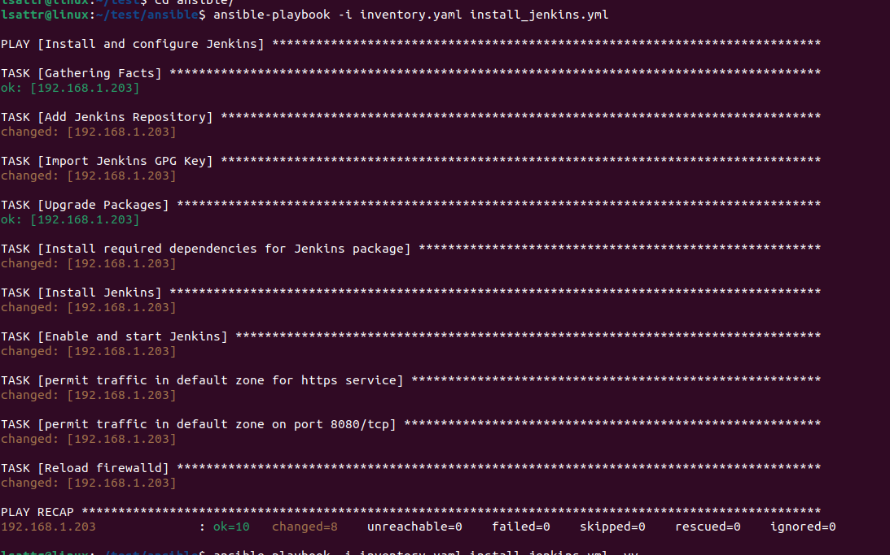
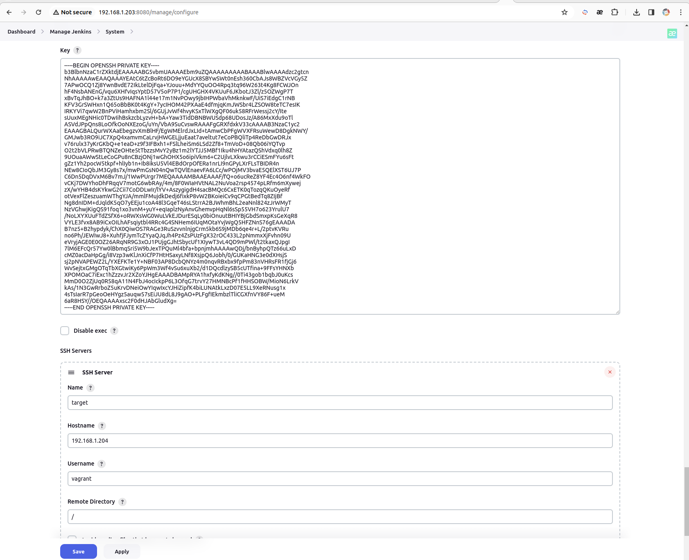
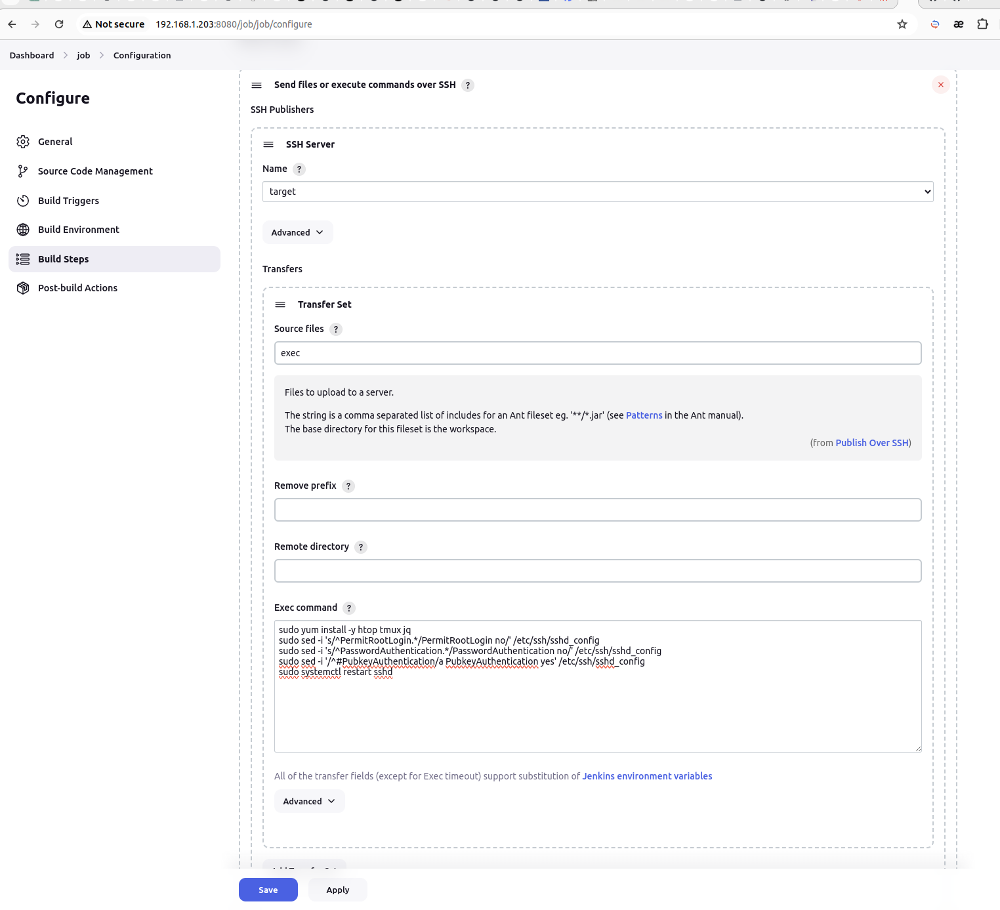
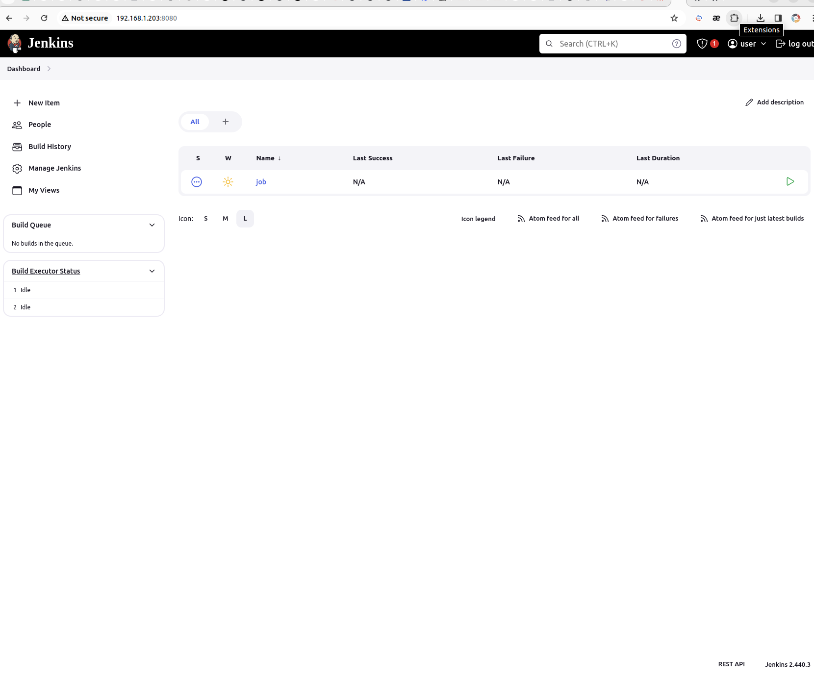
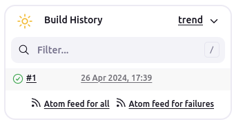
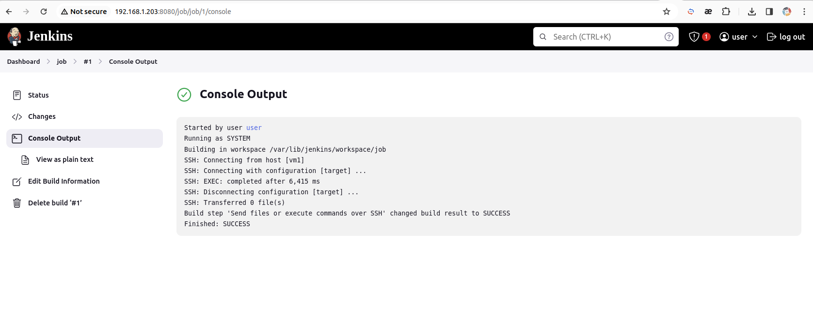
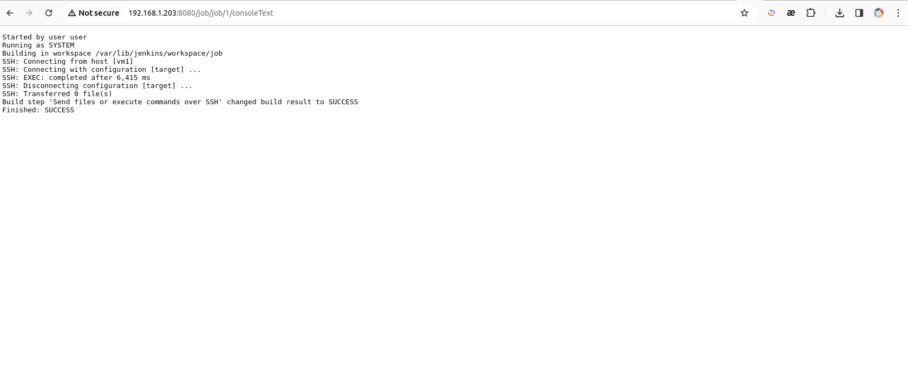

# Задание:

### *Поднять две ВМ под управлением Linux (желательно RHEL, CentOS, или Fedora).*
### *На ВМ1 c помощью Ansible установить и запустить Jenkins.*
### *В Jenkins создать и запустить Job свободной конфигурации, который выполнит на ВМ2:*
### *3.1. Установку пакетов: htop, tmux, jq.*
### *3.2.  Сконфигурирует сервис sshd таким образом, чтобы запретить пользователю root соединения по ssh с удаленных хостов и парольную аутентификацию, включит аутентификацию по SSH ключам.*
### *3.3. Перезапустит сервис sshd.*
### *В качестве результатов необходимо прислать:*
###    *1.       Ansible плэйбук и лог его выполнения.*
###    *2.       Лог и конфигурацию (можно скриншот) успешно отработавшего Jenkins Job.*
###    *3.       Файл конфигурации sshd.*
###


### 1. Ansible плэйбук и лог его выполнения:
**См. директорию ansible*
```bash
lsattr@linux:~/test/ansible$ ansible-playbook -i inventory.yaml install_jenkins.yml 

PLAY [Install and configure Jenkins] ***************************************************************************

TASK [Gathering Facts] *****************************************************************************************
ok: [192.168.1.203]

TASK [Add Jenkins Repository] **********************************************************************************
changed: [192.168.1.203]

TASK [Import Jenkins GPG Key] **********************************************************************************
changed: [192.168.1.203]

TASK [Upgrade Packages] ****************************************************************************************
ok: [192.168.1.203]

TASK [Install required dependencies for Jenkins package] *******************************************************
changed: [192.168.1.203]

TASK [Install Jenkins] *****************************************************************************************
changed: [192.168.1.203]

TASK [Enable and start Jenkins] ********************************************************************************
changed: [192.168.1.203]

TASK [permit traffic in default zone for https service] ********************************************************
changed: [192.168.1.203]

TASK [permit traffic in default zone on port 8080/tcp] *********************************************************
changed: [192.168.1.203]

TASK [Reload firewalld] ****************************************************************************************
changed: [192.168.1.203]

PLAY RECAP *****************************************************************************************************
192.168.1.203              : ok=10   changed=8    unreachable=0    failed=0    skipped=0    rescued=0    ignored=0   

```



### 2. Лог и конфигурацию (можно скриншот) успешно отработавшего Jenkins Job:








### 3. Файл конфигурации sshd:

**См. директорию sshd_config_file*

-------------------------------------------------------------------

-------------------------------------------------------------------

#### Не Выполнено:

## Кейс 1
### *"Представьте АС, уровня BO, в которой ежедневно работает до 20 тысяч пользователей. Доработку АС ведут разные команды из разных Блоков (более 15), внутри данной АС выделены несколько ФП. Ближе к концу года службой мониторинга фиксировались регулярные замедления в работе АС. «Краснели» попеременно или вместе показатели времени отклика БД, переполнения памяти, утилизации процессоров, заканчивались свободные процессы. Некоторые всплески завершались до того, как это замечали пользователи, некоторые длились часами и приводили к необходимости регистрации инцидентов со стороны пользователей. Опишите, как бы Вы решали данные инциденты и исключали их повторение для данной АС в будущем."*

## Кейс 2
### *"Вашей команде на сопровождение передают функциональную подсистему(часть от другой команды. Контроль процесса передачи этой функциональной подсистемы ложится на Ваши плечи. Опишите свой чек лист процесса передачи. "*

## Кейс 3
### *"В период технологического окна (с 00:00 до 01:00) произведено внедрение релиза АС. По итогу проведения работ никаких отклонений в работе АС не зафиксировано. С 04:00 до 06:00 поступает 3 пользовательских инцидента с жалобами на замедления в работе АС. В связи со схожим описанием инцидентов (подозрение на ВПИ) инженер дежурной смены осуществляет сбор ТКС и подключает администратора, который по результатам первичного анализа фиксирует блокировки на базе данных.*

### Опишите последовательность шагов по:

- #### *классификации и уточнению периметра инцидента*
- #### *диагностике инцидента (выявлению причин инцидента и поиск способов его устранения)*
- #### *разработке мероприятий по устранению инцидента*
- #### *закрытию инцидента в системе автоматизации SM (с заполнением всех необходимых атрибутов инцидента)"*